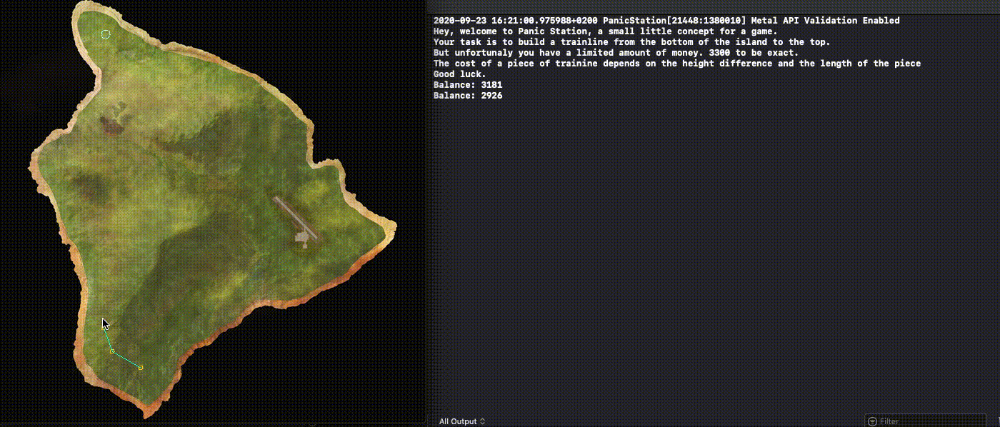

# Panic Station: A small game concept for the Udacity C++ ND

This is far from a finished game, but rather a small concept. Since it shows my ability to code using C++ I think it is sufficient as the Capstone project for the C++ NanoDegree

In this game you have to build a trainline from the bottom of an island to the top.
This trainline consist of nodes. Once you reach the goal the program closes and you see the cost of your trainline.

Building a node costs money (of course), the amount of money is based on the height of the node (is it on a mountain or in a hill), the distance from the last node and the difference in height between those two.

## Dependencies for Running Locally
* cmake >= 3.7
  * All OSes: [click here for installation instructions](https://cmake.org/install/)
* make >= 4.1 (Linux, Mac), 3.81 (Windows)
  * Linux: make is installed by default on most Linux distros
  * Mac: [install Xcode command line tools to get make](https://developer.apple.com/xcode/features/)
  * Windows: [Click here for installation instructions](http://gnuwin32.sourceforge.net/packages/make.htm)
* SDL2 >= 2.0
  * All installation instructions can be found [here](https://wiki.libsdl.org/Installation)
  * Note that for Linux, an `apt` or `apt-get` installation is preferred to building from source.
* SDL2_image
  * Instructions van be found [here](http://lazyfoo.net/tutorials/SDL/06_extension_libraries_and_loading_other_image_formats/)
* gcc/g++ >= 5.4
  * Linux: gcc / g++ is installed by default on most Linux distros
  * Mac: same deal as make - [install Xcode command line tools](https://developer.apple.com/xcode/features/)
  * Windows: recommend using [MinGW](http://www.mingw.org/)

## Basic Build Instructions
This project was written using Xcode

Go to PanicStation Folder

1. mkdir build
2. cd build/
3. cmake ..
4. make
